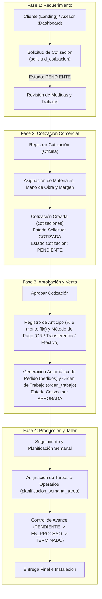

# 📋 Análisis de Funcionalidad, Flujo Operativo y Diagnóstico del Sistema
**Proyecto:** URBAN SIGNS — Sistema de Gestión Comercial y Taller  
**Fecha de Elaboración:** Octubre 2026  
**Objetivo:** Consolidar el flujo de punta a punta, auditar la consistencia de tablas y estados, y documentar el diagnóstico y plan de resolución para los problemas reportados en Cotizaciones y Seguimiento.

---

## 1. ¿El sistema es funcional? Diagnóstico General

**Sí, el sistema cuenta con su núcleo funcional operativo de punta a punta**, abarcando desde la captación del requerimiento hasta la orden de producción. Sin embargo, presentaba discrepancias en el control de navegación (acciones ejecutándose sin confirmación explícita del usuario) y llamadas a endpoints residuales que ya no existen en el backend.

### Resumen del Flujo de Punta a Punta



---

## 2. Flujo Operativo Detallado Paso a Paso

### Fase 1: Solicitud de Cotización (Entrada del Cliente)
- **Actor:** Cliente externo desde la Landing Web (`/cotizaciones/crear`) o Vendedor desde el Dashboard (`/solicitudes-cotizacion/crear`).
- **Datos que entran:** Cliente (nombre, email, teléfono, CI/NIT), detalle de trabajos requeridos (tipo de letrero, medidas de alto y ancho, descripción, ubicación).
- **Regla de negocio:** En esta fase **NO se asignan materiales ni costos**; solo se capturan las dimensiones y necesidades del cliente.
- **Tablas impactadas:** `solicitud_cotizacion`, `solicitud_trabajo`.
- **Estado inicial:** `PENDIENTE`.

### Fase 2: Elaboración de la Oferta Económica (Oficina Técnica)
- **Actor:** Diseñador / Cotizador en Dashboard (`/cotizaciones/crear/:solicitudId`).
- **Operación:** Se carga la solicitud seleccionada. El cotizador calcula los insumos requeridos (acrílico, tubos, LEDs, mano de obra, vinil), aplica precios unitarios y margen de utilidad.
- **Regla de negocio:** Al guardar la cotización:
  1. Se crea el registro formal en `cotizaciones` y sus items en `cotizacion_trabajo`.
  2. La `solicitud_cotizacion` pasa de estado `PENDIENTE` a `COTIZADA` (bloqueando ediciones sobre la solicitud base).
- **Estado inicial de la cotización:** `PENDIENTE`.

### Fase 3: Aprobación Comercial y Anticipo
- **Actor:** Cliente o Vendedor (`/cotizaciones/aprobar/:id`).
- **Operación:** El cliente acepta el presupuesto. Se define el anticipo pactado (30%, 50%, 100% o monto manual) y el método de pago (Efectivo, QR, Transferencia).
- **Regla de negocio:**
  1. La cotización cambia su estado a `APROBADA`.
  2. El backend dispara la creación de un `Pedido` y de la `Orden de Trabajo` asociada.
  3. Quedan registrados los datos de facturación/anticipo y la fecha pactada de entrega.

### Fase 4: Fabricación en Taller (Seguimiento de Trabajos)
- **Actor:** Jefe de Taller / Operarios (`/seguimiento`).
- **Operación:** Se visualiza la planificación de la semana en curso. Se asignan las órdenes de trabajo a operarios específicos, con horas estimadas y fechas de inicio/fin.
- **Regla de negocio:** Las tareas progresan a través de los estados del tablero kanban / lista hasta su culminación e instalación.

---

## 3. Análisis Arquitectónico: ¿Es necesario separar `solicitud_cotizacion` y `cotizaciones`?

### Conclusión Técnica: **SÍ, es correcto mantenerlas separadas**

| Criterio | Mantener Tablas Separadas (Actual) | Fusionar en Una Sola Tabla |
| :--- | :--- | :--- |
| **Inmutabilidad del Requerimiento** | ✅ **Protegido:** El requerimiento original del cliente nunca se altera, sirviendo de respaldo ante cualquier disputa sobre medidas o especificaciones. | ❌ **Riesgo:** Si el cotizador altera medidas al presupuestar, se pierde lo que el cliente pidió inicialmente. |
| **Versionado / Re-cotizaciones** | ✅ **Flexible:** Una misma solicitud puede generar múltiples propuestas/cotizaciones alternativas (ej. opción económica vs. opción premium). | ❌ **Complejo:** Obligaría a clonar filas con auto-referencias o tablas auxiliares. |
| **Auditoría Comercial** | ✅ **Métricas limpias:** Mide el tiempo de respuesta desde la solicitud hasta la cotización y la tasa de conversión (Solicitudes vs Cotizaciones ganadas). | ⚠️ **Difuso:** Se mezcla el ciclo de vida del cliente con el ciclo de vida financiero. |
| **Complejidad del Código** | ⚠️ Ya está implementado en JPA y Frontend. Cambiarlo implicaría rehacer endpoints, DTOs y migraciones. | ❌ Reescribir todo generaría regresiones innecesarias. |

**Veredicto:** El diseño actual de 4 tablas (`solicitud_cotizacion`, `solicitud_trabajo`, `cotizaciones`, `cotizacion_trabajo`) es el estándar recomendado para ERPs de manufactura a medida. La aparente "redundancia" no es tal, sino una separación clara entre **Requerimiento** y **Oferta Económica**.

---

## 4. Matriz de Estados (BD vs Backend vs Frontend)

### A. Solicitud de Cotización (`solicitud_cotizacion.estado`)
| Estado en BD | Significado | Acciones Disponibles en Frontend |
| :--- | :--- | :--- |
| `PENDIENTE` | Recién ingresada, pendiente de revisión | `[Ver Detalle]`, `[Editar]`, `[Registrar Cotización]`, `[Anular]` |
| `COTIZADA` | Ya cuenta con una cotización formal creada | `[Ver Detalle]` únicamente *(Editar y Registrar quedan bloqueados)* |
| `CANCELADA` | Descartada o anulada por el cliente/asesor | `[Ver Detalle]` únicamente |

### B. Cotización Formal (`cotizaciones.estado`)
| Estado en BD | Significado | Acciones Disponibles en Frontend |
| :--- | :--- | :--- |
| `PENDIENTE` | Cotización entregada al cliente, esperando respuesta | `[Ver Detalle]`, `[Descargar PDF]`, `[Editar]`, `[Aprobar Cotización]` |
| `APROBADA` | Cliente aceptó y pagó anticipo; orden en taller | `[Ver Detalle]`, `[Descargar PDF]`, `[Ver Pedido/Seguimiento]` |
| `RECHAZADA` | El cliente no aceptó la oferta | `[Ver Detalle]` |
| `CADUCADA` | Expiró la validez de la oferta (días de vigencia) | `[Ver Detalle]` |

---

## 5. Diagnóstico de Problemas Detectados

### Problema 1: Error "Error al cargar la lista de materiales" al entrar a Cotizaciones

#### Síntoma
Al ingresar a la pantalla de lista de cotizaciones, aparece una notificación toast de error indicando fallo al cargar materiales.

#### Causa Raíz
1. En `Frontend-urban-signs/src/app/components/main-pages/options/cotizaciones/list-cotizaciones/list-cotizaciones.component.html`:
   ```html
   <!-- Línea 260: El modal de modificación se instancia siempre al cargar la página -->
   <app-modificar-cotizacion [cotizacionId]="cotizacionSeleccionadaId" ...></app-modificar-cotizacion>
   ```
   Al no tener `*ngIf="mostrarModalModificacion"`, Angular crea el componente hijo inmediatamente en el arranque de la vista.
2. En `modificar-cotizacion.component.ts`:
   ```typescript
   ngOnInit(): void {
     this.cargarMateriales(); // Llama a materialesService.getSimpleMateriales()
   }
   ```
3. El servicio consulta un endpoint del módulo de inventario que fue eliminado o deprecado en el backend actual, retornando un error HTTP 404/403 que dispara el Toast.
4. Además, la lista `listMateriales` ni siquiera se utiliza en el formulario de modificación de cotización.

#### Solución a Aplicar
1. En `modificar-cotizacion.component.ts`: Remover la llamada a `this.cargarMateriales()` y eliminar el método deprecado.
2. En `list-cotizaciones.component.html`: Colocar la directiva `*ngIf="mostrarModalModificacion"` en `<app-modificar-cotizacion>` para que solo se instancie cuando el usuario explícitamente haga clic en modificar.

---

### Problema 2: Creación Automática de Filas al entrar a "Seguimiento de Pedidos"

#### Síntoma
Al hacer clic en el menú "Seguimiento de Trabajos", se inserta automáticamente una fila nueva en la base de datos (tabla `planificacion_semanal`), incrementando registros sin que el usuario haya confirmado nada.

#### Causa Raíz
En `Frontend-urban-signs/src/app/components/main-pages/options/Seguimiento-trabajos/seguimiento/seguimiento.component.ts`:
```typescript
cargarPlanificacionActual(): void {
  this.planificacionService.obtenerPlanificacionSemanaActual().subscribe({
    next: (data) => {
      this.planificacionActual = data;
    },
    error: (err) => {
      // ⚠️ CAUSA RAÍZ: Ante un 404 (no hay planificación para esta semana),
      // el código ejecutaba automáticamente la creación silenciosa en el servidor.
      this.crearNuevaPlanificacion();
    }
  });
}
```
El método `crearNuevaPlanificacion()` envía un `POST /planificaciones/crear` con `usuarioId = 1` y crea la semana en la BD de forma transparente e invasiva.

#### Solución a Aplicar
1. **Eliminar la creación automática en el bloque `error`**: Si no existe planificación para la semana actual (`404`), simplemente asignar `this.planificacionActual = null` y apagar el estado de carga.
2. **Presentar un estado vacío amigable (Empty State)** en la vista con un mensaje:
   > *"No existe una planificación creada para la semana del XX al XX."*
3. **Proveer un botón de acción explícito**:
   `[+ Iniciar Planificación de esta Semana]`, que sea activado conscientemente por el usuario cuando decida comenzar a programar órdenes de trabajo.

---

## 6. Plan de Acción y Próximos Pasos

- [x] **Paso 1:** Limpiar `modificar-cotizacion.component.ts` removiendo la dependencia y llamadas al servicio de materiales deprecado.
- [x] **Paso 2:** Condicionar la carga del modal de modificación con `*ngIf` en `list-cotizaciones.component.html`.
- [x] **Paso 3:** Corregir `seguimiento.component.ts` eliminando la creación automática en el `error` de `cargarPlanificacionActual`.
- [x] **Paso 4:** Agregar en `seguimiento.component.html` la interfaz para semana sin planificar con botón de creación manual.
- [x] **Paso 5:** Validar compilación frontend con `npm run build` y sincronizar commits a los repositorios de GitHub.
