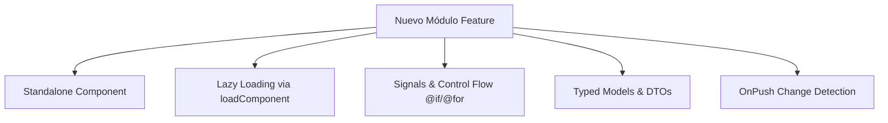

# Informe de Auditoría Técnica y Diagnóstico de Estado
**Proyecto:** URBAN SIGNS - Front-End  
**Framework:** Angular v18.2 (SSR habilitado)  
**Fecha:** Julio 2026  
**Propósito:** Evaluación de calidad, detección de deuda técnica y recomendaciones de arquitectura previa a la implementación de nuevos módulos.

---

## 1. Resumen Ejecutivo

El proyecto **URBAN SIGNS Front-End** está construido sobre **Angular 18.2** e incluye librerías modernas como TailwindCSS, RxJS, StompJS (WebSockets) y soporte para SSR (`@angular/ssr`). La aplicación posee una base sólida y funcional, así como la incorporación inicial de características modernas de Angular (como Signals en servicios de autenticación e inyección con `inject()`).

Sin embargo, el proyecto presenta un nivel considerable de **deuda técnica y patrones heterogéneos** heredados de versiones anteriores de Angular o por falta de convenciones estrictas. Destacan: la mezcla de `NgModule` con componentes `Standalone`, carga estática masiva de componentes en las rutas sin Lazy Loading refinado, un uso masivo del tipo `: any`, suscripciones RxJS sin estrategia de desuscripción y falta de separación por arquitectura de *Features*.

### Evaluaciones por Criterio

| Criterio | Calificación | Estado Actual |
| :--- | :---: | :--- |
| **Versión del Framework** | 🟢 Excelente | Angular 18.2 actualizado con SSR y TailwindCSS 3.4. |
| **Arquitectura de Enrutamiento** | 🔴 Crítico | Importación estática de +40 componentes en el enrutador; no aprovecha `loadComponent`. |
| **Modularidad y Estructura** | 🟡 Regular | Carpeta `options/` con 27 subdirectorios monolíticos en Spanglish y nombres inconsistentes. |
| **Buenas Prácticas Angular 18** | 🟡 Regular | Mezcla de Signals con RxJS sin cleanup, plantillas con `*ngIf`/`*ngFor` en lugar de Control Flow. |
| **Seguridad de Tipos (TypeScript)** | 🔴 Crítico | Uso excesivo del tipo `: any` en formularios, servicios y componentes. |
| **Performance y Estrategia** | 🟡 Regular | Estrategia de detección de cambios `Default` en todo el proyecto; sin `OnPush`. |
| **Compatibilidad con SSR** | 🟡 Regular | Llamadas directas a `localStorage` y `window/document` sin validación de plataforma. |
| **Testing y Linter** | 🔴 Deficiente | Sin ESLint configurado; pruebas unitarias `.spec.ts` en estado plantilla/CLI. |

---

## 2. Hallazgos Detallados y Deuda Técnica Detección

### 2.1. Arquitectura de Rutas y Carga Masiva (Cero Lazy Loading Granular)
* **Archivo de referencia:** [`app.routes.ts`](file:///D:/Aplicaciones%20de%20desarrollo%20de%20software/Portfolio/URBAN_SIGNS_TALLER_III/FRONT-END/src/app/app.routes.ts) y [`main-pages-routing.module.ts`](file:///D:/Aplicaciones%20de%20desarrollo%20de%20software/Portfolio/URBAN_SIGNS_TALLER_III/FRONT-END/src/app/components/main-pages/main-pages-routing.module.ts)
* **Problema:** En `main-pages-routing.module.ts` se importan estáticamente en la cabecera más de 40 componentes. Cuando el usuario ingresa a la aplicación, se descárgan y procesan simultáneamente todas las pantallas del sistema (Staff, Clientes, Compras, Cotizaciones, Proveedores, Inventarios, etc.).
* **Impacto:** Incremento exponencial en el tamaño del *bundle* inicial, mayor consumo de memoria y lentitud en la carga inicial.

### 2.2. Mezcla de Paradigmas: NgModule vs Standalone Components
* **Archivo de referencia:** [`login.component.ts`](file:///D:/Aplicaciones%20de%20desarrollo%20de%20software/Portfolio/URBAN_SIGNS_TALLER_III/FRONT-END/src/app/components/auth/login/login.component.ts) y [`main-pages.module.ts`](file:///D:/Aplicaciones%20de%20desarrollo%20de%20software/Portfolio/URBAN_SIGNS_TALLER_III/FRONT-END/src/app/components/main-pages/main-pages.module.ts)
* **Problema:** El proyecto declara la mayoría de los componentes como `standalone: true`, pero luego agrupa las páginas principales dentro de `MainPagesModule`. 
* **Impacto:** En Angular 18, el estándar recomendado es eliminar los `NgModule` y basar toda la aplicación en **Standalone Components + Standalone Routes**, simplificando el árbol de dependencias.

### 2.3. Uso Excesivo del tipo `any` y Pérdida de Seguridad en TypeScript
* **Ejemplos:** [`list-compras.component.ts`](file:///D:/Aplicaciones%20de%20desarrollo%20de%20software/Portfolio/URBAN_SIGNS_TALLER_III/FRONT-END/src/app/components/main-pages/options/compras/list-compras/list-compras.component.ts), [`list-clients.component.ts`](file:///D:/Aplicaciones%20de%20desarrollo%20de%20software/Portfolio/URBAN_SIGNS_TALLER_III/FRONT-END/src/app/components/main-pages/options/clients/list-clients/list-clients.component.ts)
* **Problema:** Existen más de 300 ocurrencias de `: any` o `any[]` en los controladores y servicios. Los formularios reactivos se inicializan sin tipos estrictos (`regForm: any`).
* **Impacto:** Anula las ventajas de TypeScript, propicia errores en tiempo de ejecución (ej: `TypeError: Cannot read properties of undefined`) y dificulta el autocompletado e refactorización en el IDE.

### 2.4. Suscripciones RxJS Abiertas (Riesgo de Memory Leaks)
* **Ejemplos:** [`seguimiento.component.ts`](file:///D:/Aplicaciones%20de%20desarrollo%20de%20software/Portfolio/URBAN_SIGNS_TALLER_III/FRONT-END/src/app/components/main-pages/options/Seguimiento-trabajos/seguimiento/seguimiento.component.ts), [`categorys.component.ts`](file:///D:/Aplicaciones%20de%20desarrollo%20de%20software/Portfolio/URBAN_SIGNS_TALLER_III/FRONT-END/src/app/components/main-pages/options/categorys/categorys.component.ts)
* **Problema:** Se realizan múltiples `.subscribe()` a `valueChanges` o peticiones HTTP sin gestionar su destrucción mediante `takeUntilDestroyed()`, `take(1)`, o guardar la suscripción para desuscribirse en `ngOnDestroy`.
* **Impacto:** Fugas de memoria (memory leaks), observables que siguen ejecutándose en segundo plano aunque el usuario haya cambiado de pantalla.

### 2.5. Sintaxis de Plantillas Legadas (`*ngIf`, `*ngFor`)
* **Problema:** Prácticamente todos los archivos HTML hacen uso de las directivas estructurales legadas `*ngIf` y `*ngFor`.
* **Impacto:** No se aprovecha el nuevo **Control Flow Syntax** (`@if`, `@for`, `@switch`) introducido en Angular 17/18, el cual es nativo, más limpio y ofrece un rendimiento significativamente superior en tiempo de compilación y renderizado.

### 2.6. Acceso Directo a Browser APIs en Entorno SSR
* **Archivo de referencia:** [`sesion.service.ts`](file:///D:/Aplicaciones%20de%20desarrollo%20de%20software/Portfolio/URBAN_SIGNS_TALLER_III/FRONT-END/src/app/core/services/sesion/sesion.service.ts)
* **Problema:** Uso directo de `localStorage.setItem()`, `document.addEventListener()` y `window.addEventListener()` dentro de servicios sin verificar si la ejecución está ocurriendo en el navegador (`isPlatformBrowser`).
* **Impacto:** Fallos runtime o advertencias críticas durante el Server Side Rendering (SSR) al ejecutarse en Node.js.

### 2.7. Inconsistencia en Estructura de Directorios y Nomenclatura
* **Carpeta `src/app/components/main-pages/options`:** Contiene 27 subcarpetas mezclando convención de nombres:
  - `Seguimiento-trabajos` (mayúscula y guiones).
  - `categorys` (palabra en inglés mal pluralizada, debería ser `categories`).
  - `clients`, `suppliers`, `staff` (nombres en inglés).
  - `solicitud-cotizacion`, `orden-impresion`, `orden-trabajo` (nombres en español).
* **Carpeta `src/app/core/services`:** Existen dos carpetas ambiguas: `sesion/` y `session/`.
* **Interceptors:** [`loggin.interceptor.ts`](file:///D:/Aplicaciones%20de%20desarrollo%20de%20software/Portfolio/URBAN_SIGNS_TALLER_III/FRONT-END/src/app/core/interceptors/loggin.interceptor.ts) posee una errata tipográfica ("loggin" en lugar de "logging").

---

## 3. Matriz de Recomendaciones y Plan para Nuevos Módulos

Para que la incorporación de nuevos módulos no perpetúe la deuda técnica actual, se debe establecer un **estándar de desarrollo estricto**.



### Prioridades de Acción

| Prioridad | Tarea | Descripción / Beneficio |
| :---: | :--- | :--- |
| 🔴 **ALTA** | **Definir Estructura de Features** | Migrar de la carpeta plana `options/` a una estructura basada en `src/app/features/<modulo>/`. |
| 🔴 **ALTA** | **Estandarizar Carga Diferida (Lazy Loading)** | Reemplazar importaciones estáticas por `loadComponent: () => import(...)` en las rutas. |
| 🔴 **ALTA** | **Eliminar `any` en Nuevos Módulos** | Crear interfaces/DTOs explícitos para todas las entidades y formularios fuertemente tipados. |
| 🟡 **MEDIA** | **Adoptar Control Flow Syntax** | Implementar `@if`, `@for` con `track` en todos los nuevos componentes y refactorizar paulatinamente los existentes. |
| 🟡 **MEDIA** | **Gestión de Memoria RxJS / Signals** | Usar `takeUntilDestroyed()` para observables o migrar a Angular **Signals** (`signal`, `computed`, `toSignal`). |
| 🟡 **MEDIA** | **Seguridad SSR (Platform Checks)** | Abstraer el uso de `localStorage` y APIs de ventana con `isPlatformBrowser(platformId)`. |
| 🟢 **BAJA** | **Configurar ESLint y Formateo** | Instalar `@angular-eslint` para prevenir reaparición de `any` y patrones obsoletos. |

---

## 4. Guía Estándar para Desarrollar Nuevos Módulos (Best Practices Angular 18)

Cada nuevo módulo que se desarrolle debe seguir obligatoriamente las siguientes pautas:

### A. Estructura de Archivos por Módulo (Feature-Based Architecture)

En lugar de colocar todo en `components/main-pages/options/`, los nuevos módulos deben ubicarse en `src/app/features/`:

```text
src/app/features/nombre-modulo/
├── components/          # Componentes visuales del módulo (List, Detail, Form)
├── models/              # Interfaces y DTOs estrictos
├── services/            # Servicios HTTP / Estado del módulo
└── nombre-modulo.routes.ts # Configuración de rutas standalone del módulo
```

### B. Plantilla de Componente Standalone Moderno

```typescript
import { Component, ChangeDetectionStrategy, inject, signal, computed, DestroyRef } from '@angular/core';
import { takeUntilDestroyed } from '@angular/core/rxjs-interop';
import { CommonModule } from '@angular/common';
import { ReactiveFormsModule, FormBuilder, Validators } from '@angular/forms';

// Importar interfaces estrictas
import { MiEntidadDTO } from '../models/mi-entidad.model';
import { MiModuloService } from '../services/mi-modulo.service';

@Component({
  selector: 'app-nuevo-modulo',
  standalone: true,
  imports: [CommonModule, ReactiveFormsModule],
  templateUrl: './nuevo-modulo.component.html',
  changeDetection: ChangeDetectionStrategy.OnPush // ✅ Optimización de Change Detection
})
export class NuevoModuloComponent {
  private readonly moduloService = inject(MiModuloService);
  private readonly destroyRef = inject(DestroyRef);

  // ✅ Estado gestionado con Signals
  public items = signal<MiEntidadDTO[]>([]);
  public isLoading = signal<boolean>(false);
  
  // ✅ Signal Computada
  public totalItems = computed(() => this.items().length);

  ngOnInit(): void {
    this.cargarDatos();
  }

  private cargarDatos(): void {
    this.isLoading.set(true);
    this.moduloService.getDatos()
      .pipe(takeUntilDestroyed(this.destroyRef)) // ✅ Auto-desuscripción limpia
      .subscribe({
        next: (data) => {
          this.items.set(data);
          this.isLoading.set(false);
        },
        error: () => this.isLoading.set(false)
      });
  }
}
```

### C. Plantilla HTML con Control Flow Syntax (`@if` / `@for`)

```html
@if (isLoading()) {
  <div class="flex justify-center p-4">
    <span>Cargando información...</span>
  </div>
} @else {
  <div class="grid grid-cols-1 md:grid-cols-3 gap-4">
    @for (item of items(); track item.id) {
      <div class="p-4 bg-white rounded-lg shadow">
        <h3 class="font-bold">{{ item.nombre }}</h3>
      </div>
    } @empty {
      <p class="text-gray-500">No hay registros disponibles.</p>
    }
  </div>
}
```

### D. Definición de Rutas del Nuevo Módulo

```typescript
// src/app/features/nuevo-modulo/nuevo-modulo.routes.ts
import { Routes } from '@angular/router';

export const NUEVO_MODULO_ROUTES: Routes = [
  {
    path: '',
    loadComponent: () => import('./components/list/list.component').then(m => m.ListComponent)
  },
  {
    path: 'nuevo',
    loadComponent: () => import('./components/form/form.component').then(m => m.FormComponent)
  }
];
```

Y en el router principal:

```typescript
// En app.routes.ts o main-pages-routing.ts:
{
  path: 'nuevo-modulo',
  loadChildren: () => import('./features/nuevo-modulo/nuevo-modulo.routes').then(m => m.NUEVO_MODULO_ROUTES)
}
```

---

## 5. Conclusión y Próximos Pasos

El proyecto cuenta con una base Angular 18 actualizada y lista para escalar. Aplicando las correcciones de arquitectura mencionadas (Lazy Loading real por componente, eliminación progresiva de `any`, adopción de Control Flow `@if`/`@for` y organización por `features/`), la aplicación ganará en:

1. **Rendimiento:** Reducción drástica del tamaño del bundle y velocidad de carga.
2. **Mantenibilidad:** Código fuertemente tipado, legible e intuitivo para cualquier desarrollador.
3. **Escalabilidad:** Los nuevos módulos no interferirán con los existentes y se cargarán bajo demanda.

---
*Informe generado automáticamente como parte del análisis pre-implementación.*
