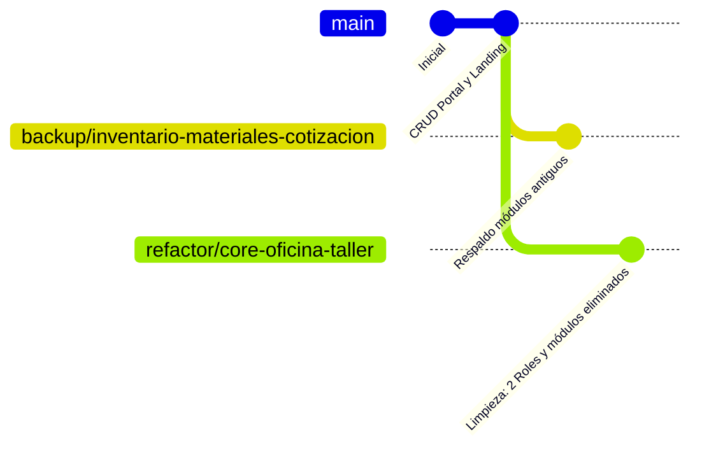

# Contexto y Arquitectura de Repositorios - Urban Signs

Este documento explica la estructura de repositorios, la evolución histórica de los proyectos y cómo funciona el control de versiones en **Urban Signs**.

---

## 1. Antecedentes: Los Repositorios Independientes

Originalmente, el sistema estaba dividido en **tres repositorios de Git independientes** en GitHub:

| Proyecto | Ruta Local | Repositorio GitHub Original |
| :--- | :--- | :--- |
| **Backend** | `URBAN_SIGNS/backend_urbansigns` | `https://github.com/Fer140421/backend_urbansigns.git` |
| **Frontend Sistema** | `URBAN_SIGNS/Frontend-urban-signs` | `https://github.com/Fer140421/Frontend-urban-signs.git` |
| **Landing Page / Portal** | `URBAN_SIGNS/LANDING_PAGE_URBAN_SIGNS` | `https://github.com/Fer140421/LANDING_PAGE_URBAN_SIGNS.git` |
| **App Móvil (Flutter)** | `URBAN_SIGNS/App---URBAN-SIGNS` | `https://github.com/Fer140421/App---URBAN-SIGNS.git` |

### ¿Por qué se respaldaron los repositorios individuales?
Trabajar con repositorios separados generaba dificultades:
- Modificar un endpoint en el backend requería hacer commit y push en un repo, y luego ir a otro repo para actualizar el frontend.
- Si las versiones no coincidían, el frontend fallaba con errores 404 o incompatibilidad de datos.
- No existía una rama única que congelara el estado global del sistema (Backend + Frontend + Base de Datos).

Los archivos `.git` originales de cada carpeta se resguardaron de forma segura dentro de cada proyecto en la carpeta oculta:
```
**/.git_standalone_backup/
```
> **Nota:** Esos respaldos locales y los repositorios remotos en GitHub **siguen existiendo intactos**. Nada fue borrado.

---

## 2. Estructura Actual: Monorepo Unificado

Para resolver la sincronización, se configuró la carpeta raíz `URBAN_SIGNS` como un **Monorepo** bajo un único repositorio general en GitHub:
👉 `https://github.com/Fer140421/PROYECTO--URBANS-SIGNS.git`

```
URBAN_SIGNS/                              <-- Repositorio Git General (.git raíz)
├── backend_urbansigns/                   <-- Código de Spring Boot
│   └── .git_standalone_backup/           <-- Respaldo del .git original del backend
├── Frontend-urban-signs/                 <-- Código de Angular (Sistema interno)
│   └── .git_standalone_backup/           <-- Respaldo del .git original del frontend
├── LANDING_PAGE_URBAN_SIGNS/             <-- Código de Angular (Web pública y portal)
│   └── .git_standalone_backup/           <-- Respaldo del .git original de la landing
├── App---URBAN-SIGNS/                    <-- Código de Flutter (App móvil Android)
│   └── .git_standalone_backup/           <-- Respaldo del .git original de la app
├── docs/                                 <-- Documentación y guías del sistema
└── supabase_clean_core_v2.sql            <-- Script DDL y semillas de la base de datos
```

### Ventajas del Monorepo en este Proyecto:
1. **Atomicidad**: Un solo commit actualiza el Backend, el Frontend y la Base de Datos al mismo tiempo.
2. **Ramas Globales**: Al cambiar de rama (por ejemplo, a `refactor/core-oficina-taller`), **todo el sistema se actualiza a la vez**, garantizando que el frontend siempre sea 100% compatible con el backend.
3. **Despliegues Coherentes**: Se evita el error típico de subir el frontend nuevo con un backend viejo.

---

## 3. ¿Qué Sucede al Abrir un Proyecto Individual en VS Code?

Si abres en VS Code directamente una subcarpeta (por ejemplo `C:\...\URBAN_SIGNS\backend_urbansigns` o `C:\...\URBAN_SIGNS\Frontend-urban-signs`):

1. **Detección Automática de Git**:
   VS Code inspecciona las carpetas superiores, encuentra el `.git` de `URBAN_SIGNS` y reconoce automáticamente en qué rama estás trabajando (por ejemplo `refactor/core-oficina-taller`).
2. **Archivos Físicos**:
   Los archivos que ves en el explorador corresponden a la rama activa del monorepo.
3. **Independencia de Ejecución**:
   Puedes compilar y ejecutar comandos de forma totalmente independiente dentro de cada carpeta:
   - En `backend_urbansigns`: `.\mvnw.cmd spring-boot:run`
   - En `Frontend-urban-signs`: `npm start`
   - En `LANDING_PAGE_URBAN_SIGNS`: `npm start`

---

## 4. Estado de las Ramas en el Repositorio General

Actualmente el repositorio general cuenta con las siguientes ramas:



1. **`main`**:
   - Contiene el código previo con todos los módulos históricos (compras, proveedores, inventario de materia prima, categorías, etc.).
2. **`backup/inventario-materiales-cotizacion`**:
   - Rama de respaldo dedicada que conserva intacta toda la lógica anterior.
3. **`refactor/core-oficina-taller` (Rama Activa)**:
   - Versión optimizada con código limpio.
   - Eliminados módulos huérfanos que no se usaban (compras, materias primas, lotes, etc.).
   - Sistema simplificado a 2 roles operativos: **`OFICINA`** y **`TALLER`** (más rol técnico `Cliente` para el portal web).

---

## 5. Preguntas Frecuentes (FAQ)

### ¿Cómo regreso al código anterior si necesito consultar algo?
Basta con ejecutar en cualquier terminal del proyecto:
```powershell
git checkout main
```
Inmediatamente los archivos de compras, proveedores e inventario volverán a aparecer en tu explorador. Para regresar a la versión limpia:
```powershell
git checkout refactor/core-oficina-taller
```

### ¿Qué ocurre con los repositorios viejos en GitHub?
Los repositorios `Fer140421/backend_urbansigns` y `Fer140421/Frontend-urban-signs` siguen existiendo en tu cuenta de GitHub con su historial hasta el 19 de septiembre de 2026. No fueron sobreescritos ni eliminados.

### ¿Se pueden enviar cambios a los repositorios viejos si alguna vez se requiere?
Sí. Si en el futuro necesitas actualizar esos repositorios individuales por separado, Git permite usar `git subtree push` para enviar únicamente la carpeta deseada a su respectivo repositorio en GitHub:
```powershell
# Ejemplo para enviar únicamente los cambios del backend a su repo individual:
git subtree push --prefix backend_urbansigns https://github.com/Fer140421/backend_urbansigns.git master
```
Sin embargo, para el desarrollo diario se recomienda continuar trabajando directamente sobre el repositorio general `PROYECTO--URBANS-SIGNS.git`.
